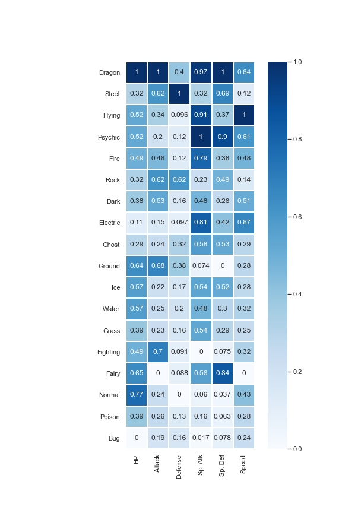
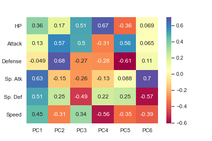

# Pokemon
Data analysis of pokemon database. Trying to understand the relation between pokemon type and attributes. 

   

## Dependencies
* Python 3
* Jupyter Notebook

## How to Run
Import `Pokemon.ipynb` file to jupyter notebook and run.

## Solution
* Imported dataset;
* Analysed some variables;
* Checked data correlation using correlation matrix and regression/distribution graphics;
* Grouped data by Pokemon Type (1) and calculated mean values of attributes;
* Normalized data and plotted heatmaps;
* Applied PCA on overall data;
* Applied PCA on data grouped by Pokemon Type (1);
* Trained RandomForest model using Pokemon data;